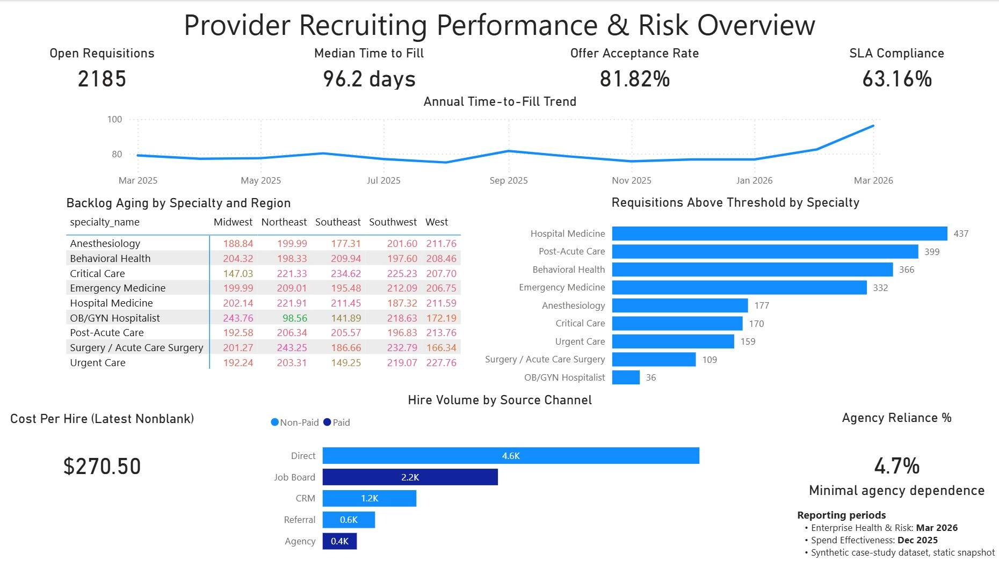

# 🏥 Healthcare Data Analytics – Data Quality & Performance Analytics  
### SQL Data Profiling, Dimensional Modeling, and Executive KPI Fact Tables (In Progress)

**Tech Stack:** SQL (SSMS / SQL Server)  
**Focus:** data quality validation + decision-ready reporting marts

---

## 🔍 Executive Summary
This project uses a **healthcare-style recruiting/workforce dataset** to demonstrate an end-to-end, SQL-first analytics workflow:

- Validate data readiness (nulls, duplicates, timeline logic, join integrity)
- Build conformed dimensions for consistent reporting
- Produce monthly, dashboard-ready fact tables that answer executive questions around:
  - enterprise recruiting health
  - staffing risk and bottlenecks
  - spend effectiveness (ROI)
  - quality and stability (attrition + offer declines)
  - recruiter capacity constraints

The emphasis is on **accuracy, traceability, and defensible KPI logic**.

This project supports my transition into a **Data Analyst** role, with healthcare-adjacent analytics patterns and real-world data challenges.

---

## 💼 Business Problem
Healthcare and healthcare-adjacent analytics datasets often contain:
- Missing or inconsistently populated fields  
- Duplicate or conflicting records  
- Event timelines that do not follow logical sequences  
- Metrics that can be misinterpreted if definitions are not controlled

Without validation and consistent definitions, reporting can be misleading.  
This project addresses the early-stage analytics problem of determining **data readiness and metric defensibility** before insights are shared.

---

## 💡 Solution
This repository follows a practical SQL workflow used in analytics teams:

1. **Profile and validate source data**  
   - volume, null rates, duplicate checks  
   - date coverage and timeline sanity checks  
   - orphan (FK-style) checks and join integrity  

2. **Create conformed dimensions**  
   - standardize reporting axes (specialty, region, recruiter)  
   - include explicit `Unknown` handling where needed  

3. **Build reporting fact tables** (dashboard-ready marts)  
   - monthly enterprise health metrics  
   - staffing risk and backlog aging  
   - spend effectiveness by source/campaign  
   - quality + stability by source (attrition + declines)  
   - recruiter workload vs capacity targets  

The focus is **analytical discipline**, not advanced modeling.

---

## 🧰 Tools and Methods

| Stage | Purpose | Tools |
|------|--------|------|
| Data Profiling | volume, null, duplicate checks | SQL |
| Data Validation | timeline and logic verification | SQL |
| Dimensional Modeling | conformed reporting attributes | SQL |
| Fact Development | KPI marts for reporting | SQL |

---

## ⚙️ Key Features
- **SQL-based data quality checks** (nulls, duplicates, PK/FK integrity)
- **Timeline and sequence validation** for recruiting lifecycle events
- **Conformed dimensions** (specialty, region, recruiter) to prevent slicer fragmentation
- **Monthly KPI marts** designed for Power BI dashboards
- **Clear assumptions + validation outputs** included in each build file

---

## 🧱 SQL Analytics Layer (Project Structure)

The SQL layer is organized as a reproducible pipeline:

### Foundation
- `00_profiling.sql`  
  Baseline profiling, timeline validity checks, PK/duplicate checks, orphan checks, and KPI readiness snapshots.

### Conformed Dimensions
- `01_dim_specialty.sql`
- `02_dim_region.sql`
- `03_dim_recruiter.sql`

### Reporting Fact Tables (Monthly Marts)
- `10_fact_enterprise_health.sql`  
  Enterprise health KPIs (open reqs, time-to-fill, offer acceptance, SLA compliance).

- `20_fact_staffing_risk.sql`  
  Staffing risk indicators by month × region × specialty (aging backlog, threshold breaches, rural vs non-rural).

- `30_fact_spend_effectiveness.sql`  
  Monthly spend and ROI signals by month × source × campaign (CPA/CPH), linking spend → applications → offers → hires.

- `40_fact_quality_stability.sql`  
  Monthly outcome quality by source (early attrition ≤90d, offer decline rate) + decline reason breakdown.

- `50_fact_recruiter_capacity.sql`  
  Monthly recruiter workload vs capacity targets (open reqs, gap, over-capacity flag) with grain validation.

SQL files are built to be rerunnable and include validation queries to confirm expected outputs.

---

## 📊 Current Status

| Component | Status |
|--------|--------|
| Data profiling & quality checks (`00_profiling.sql`) | ✅ Complete |
| Core dimensions (specialty, region, recruiter) | ✅ Complete |
| Enterprise health fact (`10_fact_enterprise_health.sql`) | ✅ Complete |
| Staffing risk fact (`20_fact_staffing_risk.sql`) | ✅ Complete |
| Spend effectiveness fact (`30_fact_spend_effectiveness.sql`) | ✅ Complete |
| Quality & stability fact (`40_fact_quality_stability.sql`) | ✅ Complete |
| Recruiter capacity fact (`50_fact_recruiter_capacity.sql`) | ✅ Complete |
| Power BI dashboard build | 🚧 In Progress (Executive Page Completed)
| Insight summary write-up | Planned |

This repository is intentionally **work in progress** and will continue to evolve.

---

## 📊 Executive Dashboard (Power BI – In Progress)

### Overview
Built an executive-facing Power BI dashboard to monitor provider recruiting performance across five key areas:

- Enterprise health (volume, efficiency, conversion, SLA performance)
- Staffing risk and backlog pressure
- Spend efficiency and cost signals
- Source channel effectiveness (paid vs non-paid)
- Agency reliance and external dependency

The dashboard is designed for quarterly business reviews (QBRs) and supports fast, high-level decision-making.

---

### Key KPIs (Leadership View)
- Open Requisitions  
- Median Time-to-Fill (days)  
- Offer Acceptance Rate  
- SLA Compliance %  
- Cost per Hire (latest non-blank)  
- Agency Reliance %  

---

### Key Insights (Current Snapshot)
- Backlog continues to grow, with rising time-to-fill indicating increasing operational strain  
- Certain specialties (e.g., Hospital Medicine, Post-Acute Care) show elevated risk levels  
- Hiring volume is primarily driven by non-paid channels (Direct, CRM, Referral)  
- Agency reliance remains low (~4.7%), indicating strong internal sourcing capability  
- Cost per hire remains stable but should be monitored alongside volume trends  

---

### Design Approach
- Prioritized clarity over density for executive readability  
- Used fixed reporting snapshot (Mar 2026) to ensure consistency  
- Structured layout to answer:
  - Are we winning or falling behind?
  - Where is risk concentrated?
  - Are we spending efficiently?
  - Are we dependent on external agencies?

---

### Notes
- This dashboard is built on SQL-generated KPI marts  
- Data is synthetic and static (no live refresh)  
- Additional pages will expand into deeper analysis per business question  

---

---

## 🧠 Skills Demonstrated
- SQL data profiling and validation
- KPI definition and metric defensibility
- Dimensional modeling fundamentals (conformed dimensions, grain control)
- Join integrity / orphan detection
- Reporting mart design for dashboards
- Analytics reasoning and documentation

---

## 🧭 Next Steps
- Build a Power BI dashboard aligned to the executive layout:
  - Enterprise Health
  - Staffing Risk & Bottlenecks
  - Spend Effectiveness
  - Stability & Quality
  - Recruiter Capacity
- Add an insights summary page with key findings and recommended actions
- Include screenshots of final visuals in this README

---

## ⚖️ Ethical and Privacy Notes
This project uses **synthetic or de-identified healthcare-style data**.  
No real patient or member data is included.  
This repository exists solely for **educational and portfolio demonstration** purposes.

---

👤 Created by Anthony Edeza  
📧 AnthonyEdeza.Data@gmail.com  

---

### 💬 Recruiter Note
This project demonstrates **data validation discipline** and **analytics judgment**, including defensible KPI logic and reporting-ready SQL marts that support executive decision-making.

---

### 🏁 Summary
> This project focuses on validating data and producing defensible KPI marts before insights are shared — a foundational responsibility of effective data analysts.
